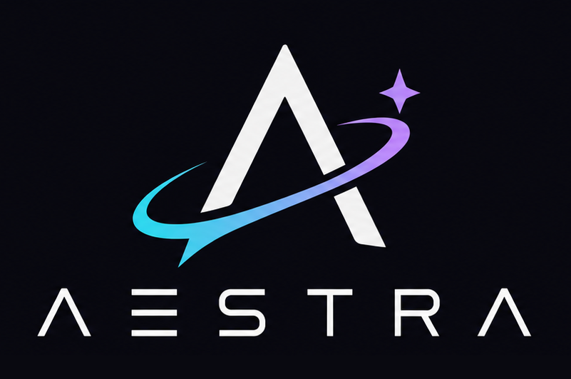

<p align="center">
  
</p>

<p align="center">
  <a href="#license"></a>
  <a href="#workspace"></a>
  <a href="https://github.com/TheHiddenWorkshop/aestra/actions/workflows/ci.yml"></a>
</p>

> [!WARNING]
> **Work in progress.** Aestra is under active development; features, APIs, and effect formats may change without notice.

**Aestra is a Bevy-native VFX choreography toolkit.** It aims to give Rust/Bevy teams the authoring depth of Niagara while keeping effect assets portable, deterministic, and comfortable to integrate into any game runtime.

## Run

```powershell
cargo run -p aestra-editor
```

The sample asset lives at [`assets/effects/prism_bloom.aestra.ron`](assets/effects/prism_bloom.aestra.ron).

## Workspace

```text
aestra/
├── apps/
│   ├── aestra-editor/       Bevy UI choreography editor
│   └── aestra-viewer/       Viewer, frame capture, and contact-sheet binary
├── bevy/
│   └── aestra-bevy/         Isolated Bevy game-runtime integration
├── assets/effects/          Authored `.aestra.ron` choreography assets
├── assets/textures/         Renderer textures referenced through stable asset IDs
└── crates/
    ├── aestra-core/         Engine-independent semantic effect model
    ├── aestra-authoring/    Commands, transactions, history, locks, and diffs
    ├── aestra-compiler/     Module registry, validation, and typed lowering
    ├── aestra-artifact/     Versioned engine-neutral compiled effect prototype
    ├── aestra-project/      Project indexing and dependency resolution
    ├── aestra-runtime/      Runtime plans and deterministic CPU execution
    ├── aestra-gpu/          GPU ABI, artifact lowering, WESL, and validation
    └── aestra-bevy-render/  Shared Bevy/WGPU presentation adapter
```

The workspace groups executable products under `apps/` and the isolated Bevy game-runtime adapter under `bevy/`. Shared internal libraries live under `crates/`; `aestra-core` owns authored format v3 and its 3D particle model, `aestra-authoring` owns UI-independent editing, `aestra-compiler` owns module discovery and lowering, `aestra-artifact` owns the versioned compiled-effect prototype, `aestra-runtime` owns immutable execution plans and instance state, and `aestra-gpu` lowers those plans into a packed engine-neutral GPU ABI and produces Naga-validated WGSL from Aestra-owned WESL. `aestra-bevy-render` registers and adapts those portable artifacts to Bevy/WGPU presentation, while `aestra-bevy` owns game playback integration. Both binaries use the same compile/runtime path.

## Viewer and visual analysis

Open the bundled example:

```powershell
cargo run -p aestra-viewer
```

Open another effect:

```powershell
cargo run -p aestra-viewer -- --effect path/to/effect.aestra.ron
```

The bundled textured example can be opened with:

```powershell
cargo run -p aestra-viewer -- --effect assets/effects/ember_sigil.aestra.ron
```

The imported flipbook example exercises explicit atlas frames across CPU, GPU-readback,
and native WESL presentation:

```powershell
cargo run -p aestra-viewer -- --effect assets/effects/plasma_burst.aestra.ron
```

Capture evenly spaced, exact 60 Hz simulation frames plus a single AI-friendly contact sheet:

```powershell
cargo run -p aestra-viewer -- --capture captures/prism-bloom --frames 9
```

The capture directory receives numbered PNG frames, `contact-sheet.png`,
`capture-manifest.md`, and a versioned `preview-report.json` for automation. Select
specific simulation frames or times when a visual check needs important boundaries rather
than evenly spaced samples:

```powershell
cargo run -p aestra-viewer -- --capture captures/prism-bloom --sample-frames 0,6,30,60
cargo run -p aestra-viewer -- --capture captures/prism-bloom --sample-times 0,0.1,0.5,1
```

Explicit values must be strictly increasing, remain inside the effect lifetime, and resolve
to distinct 60 Hz frames. The JSON report records artifact paths, exact frame/time pairs,
compiler diagnostics and optimization counts, material-program fingerprints, runtime/backend
selection, adapter limits, and measured or estimated effect metrics. Compilation and capture
failures return a non-zero exit code and write a failed report whenever an output directory is
available. In interactive mode, use Left/Right to step exact frames, `[`/`]` to change the seed,
and `S` for a single screenshot. Pass `--seed <decimal-or-hex>` to reproduce a particular run.
The manifest records the requested and selected backend, fallback reason, adapter,
driver, physical capacity, and configured particle budget. Use `--backend
auto|gpu|gpu-readback|cpu` to exercise a specific policy, or
`--max-gpu-particles <count>` to test budget fallback.

Semantic material lowering performs deterministic common-subexpression elimination for pure
constants, inputs, parameters, and operations. Commutative Add and Multiply inputs are
canonicalized. Implicit-derivative texture samples carry an explicit IR sampling contract and are
merged only when their texture and UV operands are identical; custom WESL calls remain separate
until they carry their own purity contract. The merged-expression count is preserved in compiled
artifacts, the Compiler Inspector, and `preview-report.json`, together with authored, eliminated,
and live texture-sample counts.
Shader-static parameter reads are also replaced by their typed defaults during IR lowering, so
dependent expressions can fold before backend resource reflection; the authored parameter
metadata remains available for inspection and specialization changes still alter the shader
fingerprint. `Select` nodes accept either dynamic Boolean conditions or shader-static ones. A
shader-static condition lowers only its chosen branch, so unused inputs, parameter bindings,
texture samples, and custom calls never reach shader reflection. The branch- and feature-pruning
counts are preserved alongside the other optimization metrics.

Run the native-GPU visual regression against the approved, effect-only reference:

```powershell
cargo run -p aestra-viewer -- --visual-test apps/aestra-viewer/tests/references/prism_bloom target/visual-regression/prism-bloom --frames 8
```

Run the editor viewport GPU smoke test after changing cameras, render layers, gizmos,
or the native GPU queue:

```powershell
cargo run -p aestra-viewer -- --editor-viewport-smoke target/visual-regression/editor-viewport-smoke --frames 3
```

This recreates the editor's constrained 3D preview camera and layer-15 overlay camera.
It exits with an error if GPU particles disappear from the preview or leak into an
overlay-only probe viewport, and writes the captured frames and contact sheet for review.

Use the same workflow for the textured renderer reference:

```powershell
cargo run -p aestra-viewer -- --effect assets/effects/ember_sigil.aestra.ron --visual-test apps/aestra-viewer/tests/references/ember_sigil target/visual-regression/ember-sigil --frames 8
```

The command exits with an error when a frame exceeds the tolerant foreground RMSE,
coverage, changed-pixel, or centroid limits. It writes amplified `diff-*.png` images
and `regression-report.md` to the output directory. The versioned JSON report retains the
thresholds, every frame metric, the worst-frame summary, and artifact paths on both passing and
failing comparisons, so an automated caller can analyze a rejected candidate before refining it.
After intentionally approving a visual change, regenerate the reference with:

```powershell
cargo run -p aestra-viewer -- --approve-visual-reference apps/aestra-viewer/tests/references/prism_bloom --frames 8
```

## Quality gates

Before opening a pull request, run the same deterministic checks as hosted CI:

```powershell
cargo fmt --all -- --check
cargo check --workspace --all-targets --locked
cargo clippy --workspace --all-targets --locked -- -D warnings
cargo test --workspace --locked
```

The normal workflow runs on GitHub-hosted Windows runners. Native-GPU validation is
separate because a software or headless adapter is not an equivalent rendering gate.
It runs weekly or on demand on a self-hosted Windows x64 runner with the custom `gpu`
label. That runner must have a current GitHub Actions runner, Rustup, and a Vulkan- or
DirectX-capable GPU driver. The job validates the constrained editor viewport and all
three approved effect references, then uploads captures, manifests, diffs, and reports
as a retained workflow artifact.

## Bevy plugin

```rust
use aestra_bevy::{AestraPlugin, EffectAsset, EffectPlayer};
use bevy::prelude::*;

fn main() {
    App::new()
        .add_plugins((DefaultPlugins, AestraPlugin))
        .add_systems(Startup, |mut commands: Commands| {
            let effect = EffectAsset::load_ron("assets/effects/prism_bloom.aestra.ron")
                .expect("valid effect");
            commands.spawn(EffectPlayer::new(&effect));
            commands.spawn(Camera2d);
        })
        .run();
}
```

Each player receives an `EffectProfiler` component. It exposes measured CPU and
particle statistics alongside compiler-estimated draw, dispatch, and buffer costs;
unsupported measurements such as GPU time remain explicitly unavailable.
Timed semantic notifications are emitted as `AestraChoreographyEvent` observer events. Their
typed payloads are intentionally distinct from emitter-to-emitter particle lifecycle links, so
gameplay, audio, and camera systems can subscribe without polling playback time.
Texture paths in an effect's asset registry are relative to the consuming Bevy
application's `AssetPlugin` root. Missing files use a visible checkerboard fallback
and are reported through the effect profile instead of silently removing the draw.
Renderers reference stable material IDs; sprite materials own blend state, softness,
particle-color or typed value bindings, texture assets, and normalized UV regions.
Shared materials compile once and can be reused by multiple renderers.
Flipbook renderers reference a stable atlas definition separately from their material.
Definitions store an imported texture, explicit normalized frame UVs, frame rate, and
loop policy; renderers select particle-age or effect-time playback with deterministic
random starts and forward, reverse, or ping-pong ordering.

## Development

```powershell
cargo fmt --all -- --check
cargo check --workspace
cargo test --workspace
```

See [`docs/ARCHITECTURE.md`](docs/ARCHITECTURE.md) for the product architecture and phased roadmap.

## License

Aestra is dual-licensed under the [MIT License](LICENSE-MIT) or the
[Apache License 2.0](LICENSE-APACHE), at your option.
