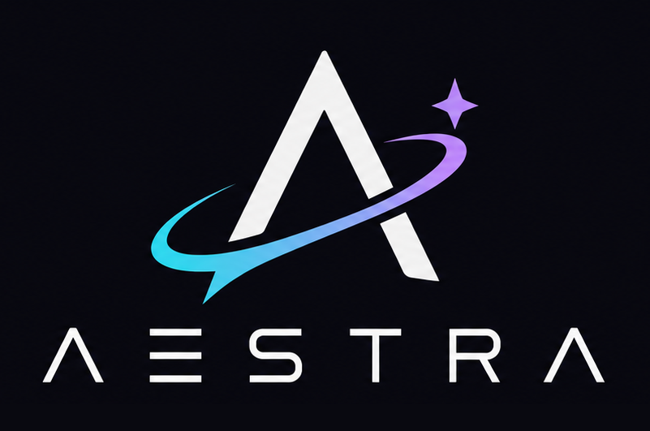

<p align="center">
  
</p>

<p align="center">
  <a href="#license"></a>
  <a href="#workspace"></a>
  <a href="https://github.com/TheHiddenWorkshop/aestra/actions/workflows/ci.yml"></a>
</p>

> [!WARNING]
> **Work in progress.** Aestra is under active development; features, APIs, and effect formats may change without notice.

**Aestra is a Bevy-native VFX choreography toolkit.** It aims to give Rust/Bevy teams the authoring depth of Niagara while keeping effect assets portable, deterministic, and comfortable to integrate into any game runtime.

## Run

Install Rust through rustup; `rust-toolchain.toml` selects the workspace toolchain.

```powershell
cargo run -p aestra-editor
```

The sample asset lives at [`assets/effects/prism_bloom.aestra.ron`](assets/effects/prism_bloom.aestra.ron).
The editor starts with an embedded, untitled copy. Use Save As to create a document, or open
the project source from the library. Saving an open document refuses to overwrite external
changes; save a separate copy or reopen the disk version to resolve the conflict.

Use **File → Open Project…** (also available in the Library) to select an asset folder,
or a project containing an `assets/` folder. The Library shows the active asset root.
Effects, referenced effects, material programs, functions, presets, and textures resolve
within that root; new effects default to its `effects/` folder when present. Switching
projects uses the unsaved-document prompt and starts an untitled document.

Opening an effect outside the active project stages a new project from its nearest
`assets/` ancestor, the parent of an `effects/` folder, or its own directory. The editor
switches only after dependencies compile successfully. For other folder layouts, choose
the project root explicitly before opening the effect. Project selection lasts for the
current editor session.

Effect edits, shared material-program edits, and extracted material functions remain
unsaved until **Save All Changes** (`Ctrl+S`). The status bar separates effect state from
pending shared-material changes. Material Graph identifies shared programs explicitly:
saving one updates every effect that uses it. **Save Effect As…** also saves pending shared
materials; it does not duplicate them. Discard abandons unsaved effect and material changes,
while already saved changes remain on disk. Undo after Save creates new unsaved changes.

Recovery snapshots include material drafts and their original source bytes. Save checks
all material sources for external changes before writing. Files are saved atomically one
at a time; an I/O failure reports remaining unsaved changes, which can be retried without
reverting files already saved.

## Workspace

```text
aestra/
├── apps/
│   ├── aestra-bench/        Runtime and compiler benchmark harness
│   ├── aestra-editor/       Bevy UI choreography editor
│   └── aestra-viewer/       Viewer, frame capture, and contact-sheet binary
├── bevy/
│   └── aestra-bevy/         Isolated Bevy game-runtime integration
├── assets/effects/          Authored `.aestra.ron` choreography assets
├── assets/textures/         Renderer textures referenced through stable asset IDs
└── crates/
    ├── aestra-core/         Engine-independent semantic effect model
    ├── aestra-authoring/    Commands, transactions, history, locks, and diffs
    ├── aestra-compiler/     Module registry, validation, and typed lowering
    ├── aestra-artifact/     Versioned engine-neutral compiled effect prototype
    ├── aestra-project/      Project indexing and dependency resolution
    ├── aestra-runtime/      Runtime plans and deterministic CPU execution
    ├── aestra-gpu/          GPU ABI, artifact lowering, WESL, and validation
    └── aestra-bevy-render/  Shared Bevy/WGPU presentation adapter
```

The workspace groups executable products under `apps/` and the isolated Bevy game-runtime adapter under `bevy/`. Shared internal libraries live under `crates/`; `aestra-core` owns authored format v3 and its 3D particle model, `aestra-authoring` owns UI-independent editing, `aestra-compiler` owns module discovery and lowering, `aestra-artifact` owns the versioned compiled-effect prototype, `aestra-runtime` owns immutable execution plans and instance state, and `aestra-gpu` lowers those plans into a packed engine-neutral GPU ABI and produces Naga-validated WGSL from Aestra-owned WESL. `aestra-bevy-render` registers and adapts those portable artifacts to Bevy/WGPU presentation, while `aestra-bevy` owns game playback integration. Both binaries use the same compile/runtime path.

## Bevy fireworks showcase

The public integration example loads the editor-authored reusable fireworks show:

```powershell
cargo run --release --locked -p aestra-bevy --example fireworks
```

It demonstrates project resolution, shared shell/material assets, playback-only history,
quality presets, HDR/bloom and authored burst lighting. Optional host-side spatial WAV
bindings use `--features fireworks-audio`; recordings remain separately licensed assets.
See [the showcase guide](docs/examples/fireworks.md) for controls, editor-to-host workflow,
audio setup and remaining visual acceptance work. Viewer/bench tooling remains separate.

## Viewer and visual analysis

Open the bundled example:

```powershell
cargo run -p aestra-viewer
```

Open another effect:

```powershell
cargo run -p aestra-viewer -- --effect path/to/effect.aestra.ron
```

The bundled textured example can be opened with:

```powershell
cargo run -p aestra-viewer -- --effect assets/effects/ember_sigil.aestra.ron
```

The imported flipbook example exercises explicit atlas frames across CPU, GPU-readback,
and native WESL presentation:

```powershell
cargo run -p aestra-viewer -- --effect assets/effects/plasma_burst.aestra.ron
```

Capture evenly spaced, exact 60 Hz simulation frames plus a single AI-friendly contact sheet:

```powershell
cargo run -p aestra-viewer -- --capture captures/prism-bloom --frames 9
```

The capture directory receives numbered PNG frames, `contact-sheet.png`,
`capture-manifest.md`, and a versioned `preview-report.json` for automation. Select
specific simulation frames or times when a visual check needs important boundaries rather
than evenly spaced samples:

```powershell
cargo run -p aestra-viewer -- --capture captures/prism-bloom --sample-frames 0,6,30,60
cargo run -p aestra-viewer -- --capture captures/prism-bloom --sample-times 0,0.1,0.5,1
```

Explicit values must be strictly increasing, remain inside the effect lifetime, and resolve
to distinct 60 Hz frames. The JSON report records artifact paths, exact frame/time pairs,
compiler diagnostics and optimization counts, material-program fingerprints, runtime/backend
selection, adapter limits, and measured or estimated effect metrics. Compilation and capture
failures return a non-zero exit code and write a failed report whenever an output directory is
available. In interactive mode, use Left/Right to step exact frames, `[`/`]` to change the seed,
and `S` for a single screenshot. Pass `--seed <decimal-or-hex>` to reproduce a particular run.
The manifest records the requested and selected backend, fallback reason, adapter,
driver, physical capacity, and configured particle budget. Use `--backend
auto|gpu|gpu-readback|cpu` to exercise a specific policy, or
`--max-gpu-particles <count>` to test budget fallback.

Opt into a fixed photographic response for luminous effects (legacy previews remain unchanged):

```powershell
cargo run --locked -p aestra-viewer -- --fireworks-f0 --fireworks-f0-probe f3-chrysanthemum --camera wide --backend gpu --history playback-only --hdr --exposure 0 --tonemapping tony --bloom 0.15 --sample-frames 45,80,110,150,210,300 --capture target/fireworks-f4/chrysanthemum-radiance
```

`--hdr` enables a floating-point intermediate target, not HDR monitor output. The photographic
options also enable HDR individually: `--exposure` accepts fixed relative stops from -8 to 8,
`--tonemapping` accepts `tony`, `aces`, or `reinhard`, and `--bloom` accepts a scattering strength
from 0 to 1 (0 disables bloom). Defaults are 0 stops, Tony McMapface and natural,
energy-conserving bloom at 0.15. No auto exposure is used; deband dithering is disabled in this
mode. Exposure is Bevy's scene-wide color-grading exposure, so it affects Aestra's unlit
particles as well as scene geometry; it is not a calibrated physical camera EV100 control.
Bloom runs before this display exposure. Capture reports record the effective settings under
`capture.response`; PNGs are the tonemapped SDR result. Settings → Preview exposes the same
profile in the editor: enable Photographic preview, then adjust Exposure, Bloom and Tonemapping.
Preferences are persisted; older settings keep HDR disabled. Only the effect viewport camera
receives photographic grading; thumbnails and node previews are unchanged. Gizmo/UI cameras
remain LDR and use transparent compositing over the HDR viewport. The editor viewport layering smoke
test accepts the same options for native GPU validation. Physical radiance tuning remains
separate follow-up work.

Aestra's unlit semantic material `Color` output already accepts linear RGB above 1; alpha and
coverage remain opacity, not an emission multiplier. HDR hosts should preserve this radiance in
their target and apply their display transform once after compositing. A separate `Emissive`
output is not necessary for these unlit fireworks; lit material/light transport would require
a separate design. Exposure, bloom, camera, sky and audio remain host presentation concerns.

The four editable shell prototypes expose `Star radiance` (default 8) and `Trail radiance`
(default 4) as ordinary effect scalar parameters. Star gain also covers the launch, flash and
Pistil's inner stars; trail gain affects ribbon history independently. Smoke, cooling colors,
opacity, trajectories and widths are unchanged. The material graphs clamp these artistic
linear-RGB multipliers to 0..64 (not an engine-wide radiance limit); old material instances
without a binding retain gain 1. Use an HDR camera and start at 0 display stops. These defaults
are a visual starting point, not physical calibration or certified subpixel energy preservation.

Native GPU hosts can opt into `aestra_bevy::SpriteSampling { minimum_pixels: 2.0 }`, or pass
`--sprite-min-pixels 2` to the viewer. The default 0 preserves previous images. This expands
undersampled additive sprite quads in physical main-pass pixels and applies inverse-area alpha
attenuation; simulation, replay and authored radiance remain independent. Values are finite
0..8; it does not enable HDR. Explicit CPU/readback modes reject a nonzero viewer policy;
with automatic fallback, check the reported selected backend (CPU ignores the policy).
`capture.response.sprite_minimum_pixels` records the normalized requested policy. Flipbooks,
meshes and strip/trail renderers are unchanged. This is continuous-area compensation, not
exact pixel-integrated radiometry or universal temporal antialiasing. Qualifying draws bypass
CPU frustum culling to avoid clipping expanded footprints, so production/offscreen budgets
still need measurement. Editor defaults remain unchanged.

`--gpu-bench output.json` now records the requested presentation profile, seed, camera, tier,
ordering, budget and render mode alongside the detected adapter/driver, observed per-effect
backends and physical primary-window sizes. Compare native-GPU runs with matching setup and
work; a requested pixel floor is not proof a fallback renderer applied it. Multiple observed
backends or window sizes indicate a mixed measured window. Player hotkeys are disabled during
benchmarks to keep recorded seed/playback/render-mode settings fixed. Missing timestamp samples
remain unavailable, and stage percentiles must not be summed into whole-frame costs.

The native sprite conformance test also sweeps moving quarter-pixel quads across pixel phases,
checking dropout, brightness modulation and phase-averaged coverage against the continuous
procedural mask integral. Two pixels is a low-cost starting policy; four pixels reduces modulation
further in this bounded probe but can increase fill substantially. Neither certifies arbitrary
textures, HDR post-processing, trail antialiasing or finale budgets.

For bounded fill/culling stress, use `--fireworks-f0 --fireworks-f0-probe f4-sprite-fill`
or `f4-sprite-offscreen` with `--camera wide --backend gpu --history playback-only`.
Both run 65,536 stationary additive sprites: nominal quarter-pixel quads in a 16×16-pixel
patch at 960×540. The second moves the same cohort wholly offscreen through host placement.
Compare `--sprite-min-pixels 0`, `2`, and `4` with identical HDR/material options and
`--gpu-bench output.json`. Reports record nominal probe calibration separately from observed
window sizes and record whether legacy materials were migrated with `--semantic-materials`.
The native raster test covers all four viewport edges and fully clipped expanded footprints.
Expansion increases fragment work; culling bypass still submits offscreen vertices. These
probes measure that tradeoff, not an authored finale or a universal production budget.

Semantic material lowering performs deterministic common-subexpression elimination for pure
constants, inputs, parameters, and operations. Commutative Add and Multiply inputs are
canonicalized. Implicit-derivative texture samples carry an explicit IR sampling contract and are
merged only when their texture and UV operands are identical; custom WESL calls remain separate
until they carry their own purity contract. The merged-expression count is preserved in compiled
artifacts, the Compiler Inspector, and `preview-report.json`, together with authored, eliminated,
and live texture-sample counts.
Explicit-LOD sampling is available through the typed `Sample Texture Level` graph node. Its Float
level participates in CSE identity and lowers portably to `textureSampleLevel`.
Explicit-gradient sampling is available through `Derivative X`, `Derivative Y`, and
`Sample Texture Gradient`. The typed `Vec2` gradients participate in CSE identity and lower
portably to `dpdx`, `dpdy`, and `textureSampleGrad`.
Reusable material functions share an expansion when their function reference and resolved,
input-ID-ordered argument bindings match. Multiple outputs reuse the same internal expressions;
custom WESL functions and functions containing them stay separate. Original call IDs remain in
the source map or its eliminated set. Function-call counts are available in artifacts, the
Compiler Inspector, and preview reports: authored counts resolved output sites (including nested
sites in shared expansions), live counts surviving invocation/output pairs, and eliminated is
their difference.
Shader-static parameter reads are also replaced by their typed defaults during IR lowering, so
dependent expressions can fold before backend resource reflection; the authored parameter
metadata remains available for inspection and specialization changes still alter the shader
fingerprint. `Select` nodes accept either dynamic Boolean conditions or shader-static ones. A
shader-static condition lowers only its chosen branch, so unused inputs, parameter bindings,
texture samples, and custom calls never reach shader reflection. The branch- and feature-pruning
counts are preserved alongside the other optimization metrics.
Semantic sprite shaders derive a compact varying layout from optimized live inputs. Both stages
use the same deterministic locations, keep required coverage/visibility fields, and share color
alpha when particle color and opacity are both read. Layout identity participates in shader and
pipeline caching; legacy and wireframe rendering use their separate compact interface.
Native GPU presentation also unions live particle-attribute requirements across each emitter's
renderers. Unused appearance calculations and vertex reads are skipped; geometry, lifetime-driven
flipbook age, and wireframe color remain available where needed. The 48-byte particle storage ABI
is unchanged, omitted fields receive deterministic defaults, and GPU-readback mode retains full
CPU-reference data. The Compiler Inspector shows a rendered-mode attribute-count estimate;
runtime material overrides and render modes may change the actual requirements.

Run the native-GPU visual regression against the approved, effect-only reference:

```powershell
cargo run -p aestra-viewer -- --visual-test apps/aestra-viewer/tests/references/prism_bloom target/visual-regression/prism-bloom --frames 8
```

Run the editor viewport GPU smoke test after changing cameras, render layers, gizmos,
or the native GPU queue:

```powershell
cargo run -p aestra-viewer -- --editor-viewport-smoke target/visual-regression/editor-viewport-smoke --frames 3
```

This recreates the editor's constrained 3D preview camera and layer-15 overlay camera.
It exits with an error if GPU particles disappear from the preview or leak into an
overlay-only probe viewport, and writes the captured frames and contact sheet for review.

Use the same workflow for the textured renderer reference:

```powershell
cargo run -p aestra-viewer -- --effect assets/effects/ember_sigil.aestra.ron --visual-test apps/aestra-viewer/tests/references/ember_sigil target/visual-regression/ember-sigil --frames 8
```

Volumetric fluids (fluid F3) draw only through a 3D camera, so their references use `--view3d`,
which frames the effect's simulation domains:

```powershell
cargo run -p aestra-viewer -- --backend gpu --view3d --effect sample-project/effects/fluid_fire.aestra.ron --visual-test apps/aestra-viewer/tests/references/fluid_fire target/visual-regression/fluid-fire --frames 8
```

The command exits with an error when a frame exceeds the tolerant foreground RMSE,
coverage, changed-pixel, or centroid limits. It writes amplified `diff-*.png` images
and `regression-report.md` to the output directory. The versioned JSON report retains the
thresholds, every frame metric, the worst-frame summary, and artifact paths on both passing and
failing comparisons, so an automated caller can analyze a rejected candidate before refining it.
After intentionally approving a visual change, regenerate the reference with:

```powershell
cargo run -p aestra-viewer -- --approve-visual-reference apps/aestra-viewer/tests/references/prism_bloom --frames 8
```

## Quality gates

Before opening a pull request, run the same deterministic checks as hosted CI:

```powershell
cargo fmt --all -- --check
cargo check --workspace --all-targets --locked
cargo clippy --workspace --all-targets --locked -- -D warnings
cargo test --workspace --locked
```

The normal workflow runs on GitHub-hosted Windows runners. Native-GPU validation is
separate because a software or headless adapter is not an equivalent rendering gate.
It runs weekly or on demand on a self-hosted Windows x64 runner with the custom `gpu`
label. That runner must have a current GitHub Actions runner, Rustup, and a Vulkan- or
DirectX-capable GPU driver. The job validates the constrained editor viewport and all
three approved effect references, then uploads captures, manifests, diffs, and reports
as a retained workflow artifact.

## Bevy plugin

```rust
use aestra_bevy::{AestraPlugin, EffectAsset, EffectPlayer};
use bevy::prelude::*;

fn main() {
    App::new()
        .add_plugins((DefaultPlugins, AestraPlugin))
        .add_systems(Startup, |mut commands: Commands| {
            let effect = EffectAsset::load_ron("assets/effects/prism_bloom.aestra.ron")
                .expect("valid effect");
            commands.spawn(EffectPlayer::new(&effect));
            commands.spawn(Camera2d);
        })
        .run();
}
```

Each player receives an `EffectProfiler` component. It exposes measured CPU and
particle statistics alongside compiler-estimated draw, dispatch, and buffer costs;
unsupported measurements such as GPU time remain explicitly unavailable.
For reusable child clips, resolve the complete project before spawning:

```rust
let index = aestra_project::ProjectAssetIndex::scan("assets");
let project = aestra_bevy::EffectCompiler::default().compile_project(&effect, &index)?;
commands.spawn(EffectPlayer::from_project(std::sync::Arc::new(project)));
```

Control the root player normally; the plugin manages active child presentations,
clip timing, seeds, parameters and inherited motion. The editor and viewer use the
same scheduler. See [nested motion and playback](docs/host_motion_tracks.md#nested-clips).
`ProjectProfiler` exposes active root-and-child totals and per-clip breakdowns after
`AestraSet::Profile`; `EffectProfiler` remains root-only for existing integrations.
The editor Profiler and viewer capture reports use project totals. Native-GPU live counts
use lightweight asynchronous per-emitter telemetry, with stale results rejected after
playback/context changes. GPU simulation timestamps provide per-instance and project costs
on supported devices, separately from rendering. Actual draw-command telemetry reports submitted
instances, vertex/index references, primitives and draw calls, including per-view costs.
Missing measurements remain unavailable, and shared
texture memory is not double-counted.
Timed semantic notifications from the root
and nested clips are emitted as `AestraChoreographyEvent` observer events. `player` identifies the
root entity, `clip_path` identifies the source instance (empty for the root), and `effect` identifies
the compiled source. Seeks, frame stepping, and external clock synchronization are silent;
normal forward playback emits crossed events, including short clips and loop boundaries. Their
typed payloads are intentionally distinct from emitter-to-emitter particle lifecycle links, so
gameplay, audio, and camera systems can subscribe without polling playback time.
Texture paths in an effect's asset registry are relative to the consuming Bevy
application's `AssetPlugin` root. Missing files use a visible checkerboard fallback
and are reported through the effect profile instead of silently removing the draw.
Renderers reference stable material IDs; sprite materials own blend state, softness,
particle-color or typed value bindings, texture assets, and normalized UV regions.
Shared materials compile once and can be reused by multiple renderers.
Flipbook renderers reference a stable atlas definition separately from their material.
Definitions store an imported texture, explicit normalized frame UVs, frame rate, and
loop policy; renderers select particle-age or effect-time playback with deterministic
random starts and forward, reverse, or ping-pong ordering.

## Development

```powershell
cargo fmt --all -- --check
cargo check --workspace
cargo test --workspace
```

See [`docs/ARCHITECTURE.md`](docs/ARCHITECTURE.md) for the product architecture and phased roadmap.

## License

Aestra is dual-licensed under the [MIT License](LICENSE-MIT) or the
[Apache License 2.0](LICENSE-APACHE), at your option.
